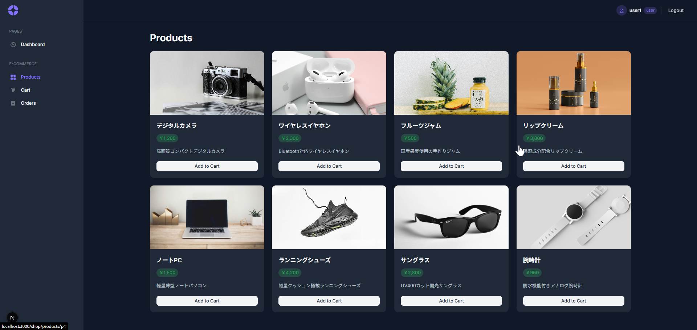
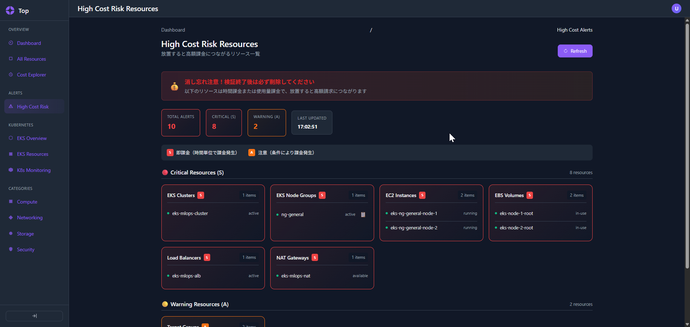
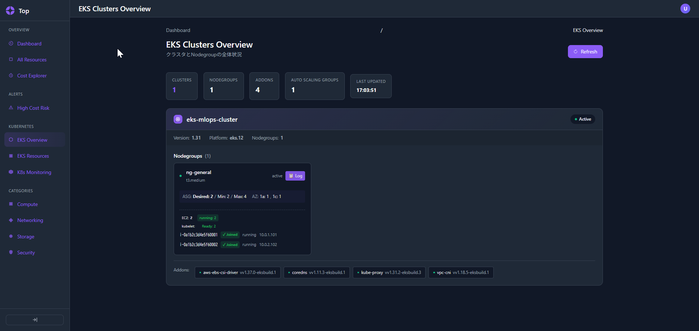

# EKS MLOps Platform

AWS EKS上で動作するEC Shopアプリケーション + MLOps分析パイプライン + AWSリソース監視基盤

---





## クイックスタート

### ローカル開発

```bash
# Backend (port 8000)
make local-dev-backend

# Frontend (port 3000)
make local-dev-frontend

# 両方同時起動
make local-dev
```

### テスト

```bash
make local-test          # Backend Unit tests
make local-test-e2e      # Backend E2E tests
make eks-smoke-strict    # インフラ疎通テスト (CI)
```

### ビルド・デプロイ

```bash
# Docker イメージ
make build-backend
make build-frontend

# ECR プッシュ
make push                # latest
make push TAG=v1.0.0     # タグ指定

# EKS デプロイ
make eks-init && make eks-deploy
make eks-k8s-deploy
```

---

## プロジェクト構成

### apps/ - アプリケーション

| ディレクトリ | 説明 |
|-------------|------|
| `app-backend/` | Hono API サーバー (TypeScript) — EC Shop、分析API、認証連携 |
| `app-frontend/` | Next.js 16 フロントエンド — 商品ページ、ダッシュボード |
| `auth/` | 認証ゲートウェイ — JWT/Cognito (Renderデプロイ) |
| `aws-resource-monitor/` | AWSリソース監視 — DDD/クリーンアーキテクチャ、20+ AWSサービスアダプター |

### infra/ - インフラストラクチャ

| ディレクトリ | 説明 |
|-------------|------|
| `terraform/prod/` | 本番EKS — VPC, EKS, ALB, Karpenter |
| `terraform/shared/` | 共有リソース — ECR, S3, Firehose |
| `k8s/overlays/` | Kustomize環境別設定 (local/staging/prod) |
| `k8s/apps/` | アプリK8sマニフェスト |
| `k8s/cnpg/` | PostgreSQLオペレーター |
| `k8s/monitoring/` | Prometheus/Grafana監視 |

### mlops/ - ML パイプライン

| ファイル | 説明 |
|---------|------|
| `src/analytics.py` | DuckDB売上分析 |
| `src/sentiment.py` | 日本語感情分析 |
| `src/train.py` | モデル学習 (RandomForest/LinearRegression) |
| `src/preprocess.py` | データ前処理 |
| `k8s/` | K8s Job定義 (7ステージ) |

### scripts/infra - インフラ自動化 (DDDアーキテクチャ)

| ディレクトリ | 説明 |
|-------------|------|
| `cli/` | CLIエントリーポイント (terraform / kubernetes / mlops) |
| `domain/` | ドメイン層 — EksCluster, NodeGroup, 値オブジェクト (Phase, Overlay, Region) |
| `usecases/` | ユースケース層 — ProvisionCluster, DeployAll, DeployApp, DeployGPU 等 |
| `infrastructure/` | インフラ層 — AWS API, K8s Deployer/Monitor, Terraform Runner |
| `framework/` | 共通基盤 — Command Builder, Poller (指数バックオフ), Preflight, Structured Logging |
| `smoke/` | Smokeテスト (8スイート: AWS/EKS/K8s/DB/App/Auth/Login/Monitoring) |
| `container/` | Awilix DIコンテナ |
| `tools/` | ユーティリティ (AWS 7種, Bastion接続, K8sデバッグ) |

---

## 主要機能

### EC Shop (Backend + Frontend)
- 商品一覧・詳細表示
- カート管理・チェックアウト
- ユーザー認証 (JWT / Cognito委譲)
- 管理者機能 (監査ログ、分析ダッシュボード)

### MLOps 分析パイプライン
- 売上データ分析 (カテゴリ別、地域別、トレンド)
- 日本語レビュー感情分析
- DuckDB / Snowflake 切替可能な分析エンジン
- S3経由でAPI連携

### AWS Resource Monitor
- 20+ AWSサービスの統合監視 (EC2, EKS, S3, RDS, Lambda 等)
- K8s / Prometheusメトリクス連携
- コスト監視 (Cost Explorer)
- DDD/クリーンアーキテクチャ (35+ Unit Tests)

### インフラ
- 3環境対応 (Local/Staging/Production)
- Karpenter GPU オートスケーリング
- IRSA (IAM Roles for Service Accounts)
- DDD構造のインフラ自動化フレームワーク (36 Unit Tests, 8 Smoke Tests)

---

## 環境

| 環境 | インフラ | コスト |
|-----|---------|-------|
| Production | AWS EKS (t3.medium) | ~$103/月 |
| Staging | EC2 Spot + Kind | ~$9/月 |
| Local | Kind on WSL | 無料 |

---

## ドキュメント

| ファイル | 説明 |
|---------|------|
| [`README-プレゼンテーション.md`](README-プレゼンテーション.md) | 設計思想・技術選定の背景 (ポートフォリオ) |
| [`README-実装カタログ.md`](README-実装カタログ.md) | 各コンポーネントの実装リファレンス |
| [`README-進捗管理.md`](README-進捗管理.md) | 進捗管理 (Kind/EKS環境別ステータス) |
| [`README Make EKS.md`](README%20Make%20EKS.md) | EKSデプロイ手順 (Phase 1-9) |
| [`CLAUDE.md`](CLAUDE.md) | Claude Code向けガイド |
| [`apps/app-backend/README.md`](apps/app-backend/README.md) | Backend API仕様・セットアップ |
| [`apps/auth/README.md`](apps/auth/README.md) | 認証サービス仕様 |
| [`mlops/README.md`](mlops/README.md) | MLOpsパイプライン詳細 |

---

## コマンド一覧

```bash
make help    # 全コマンド表示
```

### よく使うコマンド

| コマンド | 説明 |
|---------|------|
| `make local-dev-backend` | Backend開発サーバー起動 |
| `make local-dev-frontend` | Frontend開発サーバー起動 |
| `make local-test` | Backendテスト実行 |
| `make local-db-migrate` | DBマイグレーション |
| `make local-db-seed` | DBシード投入 |
| `make mlops-analytics` | 分析ジョブ実行 (EKS) |
| `make mlops-sentiment` | 感情分析ジョブ実行 (EKS) |
| `make eks-k8s-deploy` | アプリをEKSにデプロイ |
| `make eks-k8s-status` | Pod/Service状態確認 |
